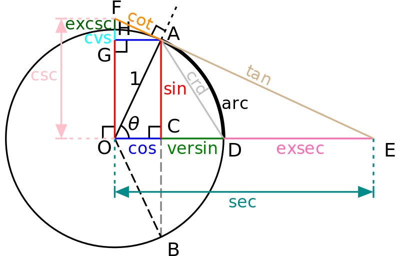

# rust_fundamentals
learning rust fundamentals with Pluralsight 

<hr />

## Haversine

Did you know that there are more than the 3 trigonometric functions we are all familiar with sine, cosine and, tangent? These additional trigonometric functions are now obsolete, however, in the past, they were worth naming. 

The additional trigonometric functions are versine, haversine, coversine, hacoversine, exsecant, and excosecant. All of these can be expressed simply in terms of the more familiar trigonometric functions. For example, haversine(θ) = sin²(θ/2).

The haversine formula is a very accurate way of computing distances between two points on the surface of a sphere using the latitude and longitude of the two points. The haversine formula is a re-formulation of the spherical law of cosines, but the formulation in terms of haversines is more useful for small angles and distances.

One of the primary applications of trigonometry was navigation, and certain commonly used navigational formulas are stated most simply in terms of these archaic function names. But you might ask, why not just simplify everything down to sines and cosines? The functions listed above were from a time without calculators, or efficient computer processors, when the user calculated angles and direction by hand using log tables, every named function took appreciable effort to evaluate. The point of these functions is if a table simply combines two common operations into one function, it probably made navigational calculations on a rocking ship more efficient.

These function names have a simple naming pattern and in this example, the "Ha" in "Haversine" stands for "half versed sine" where haversin(θ) = versin(θ)/2.



## Haversine Formula

The Haversine formula is perhaps the first equation to consider when understanding how to calculate distances on a sphere. The word "Haversine" comes from the function:

haversine(θ) = sin²(θ/2)

The following equation where φ is latitude, λ is longitude, R is earth’s radius (mean radius = 6,371km) is how we translate the above formula to include latitude and longitude coordinates. Note that angles need to be in radians to pass to trig functions:

a = sin²(φB - φA/2) + cos φA * cos φB * sin²(λB - λA/2)
c = 2 * atan2( √a, √(1−a) )
d = R ⋅ c

We can write this formula into a Python script where the input parameters are a pair of coordinates as two lists:

'''
Calculate distance using the Haversine Formula
'''

```
def haversine(coord1: object, coord2: object):
    import math

    # Coordinates in decimal degrees (e.g. 2.89078, 12.79797)
    lon1, lat1 = coord1
    lon2, lat2 = coord2

    R = 6371000  # radius of Earth in meters
    phi_1 = math.radians(lat1)
    phi_2 = math.radians(lat2)

    delta_phi = math.radians(lat2 - lat1)
    delta_lambda = math.radians(lon2 - lon1)

    a = math.sin(delta_phi / 2.0) ** 2 + math.cos(phi_1) * math.cos(phi_2) * math.sin(delta_lambda / 2.0) ** 2
    
    c = 2 * math.atan2(math.sqrt(a), math.sqrt(1 - a))

    meters = R * c  # output distance in meters
    km = meters / 1000.0  # output distance in kilometers

    meters = round(meters, 3)
    km = round(km, 3)


    print(f"Distance: {meters} m")
    print(f"Distance: {km} km")
```

The result will print as below:

```
haversine([-0.116773, 51.510357], [-77.009003, 38.889931])

Distance: 5897658.289 m
Distance: 5897.658 km
```
